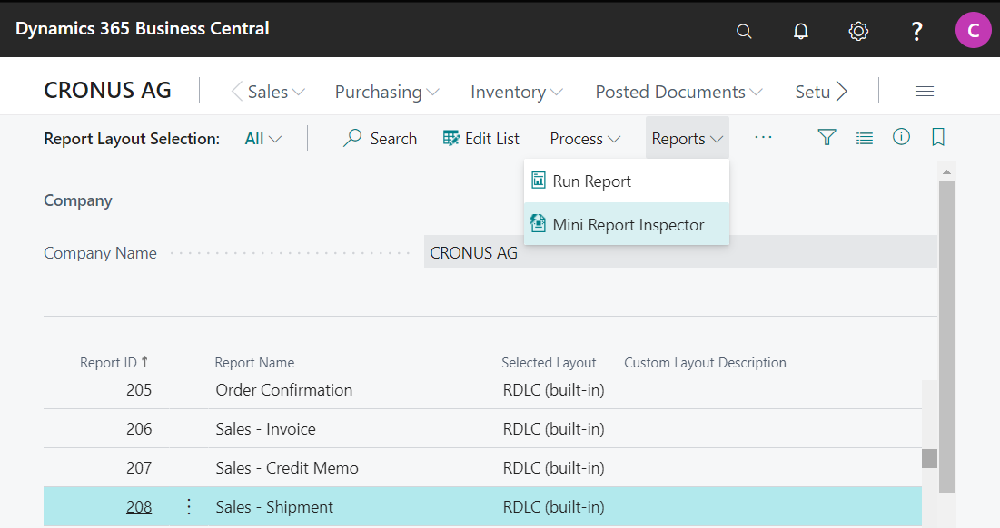
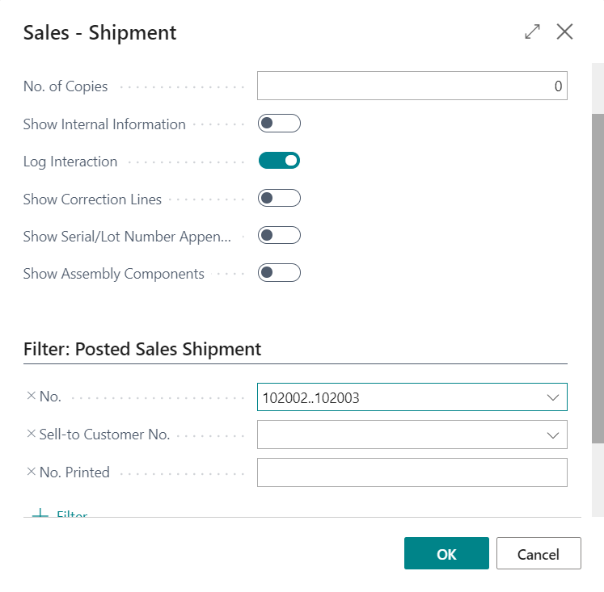
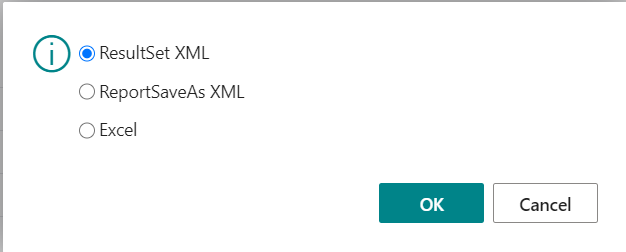
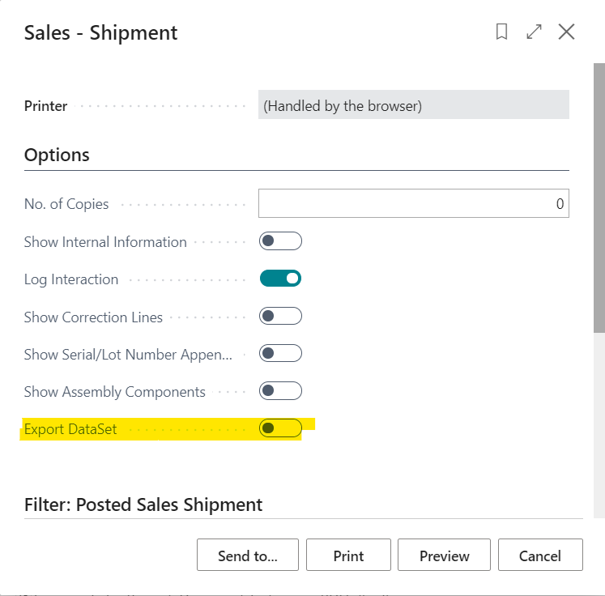
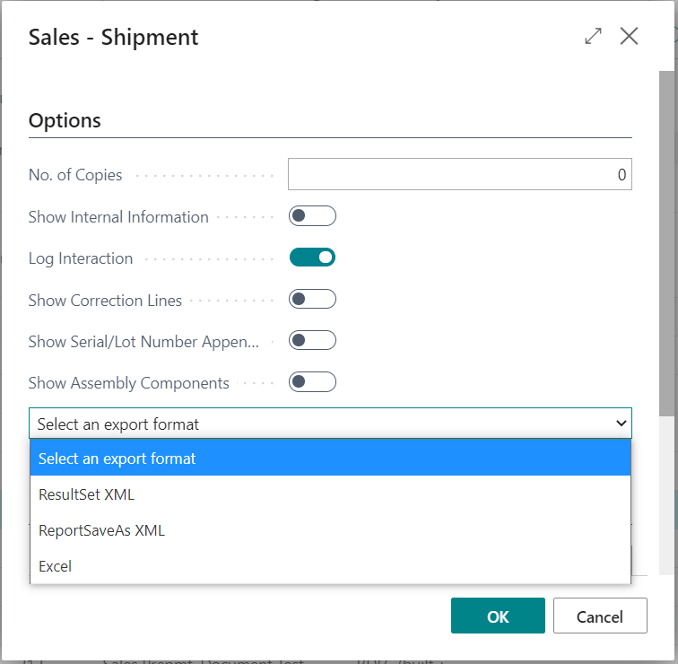

# Mini Report Inspector

The Mini Report Inspector enables you to export informations about the report DataSet in 3 different formats:

* **SaveAsXML** the Result from Report.SaveAsxml
* **ResultSet XML** the Dataset format known from the windows client as XML File
* **Excel** the Dataset format known from the windows client as Excel File

## Limitations:
Only available for Reports with integrated RDLC Layout.
The data is collected by parsing the SaveAsXML File (Columns) and the RLDC File (Order of Columns). Not all Metadata is available to recreate a complete DataSet.xml like in the windows client (e.g. XSD Section).

## Integration Types

### "Report Layout Selection" Integration
Start by clicking "Mini Report Inspector" Action.

Set your filters in the SaveRequestPage dialog.

Choose the export format from the Stringmenu.

### "Report Request Page" Integration
Toggle the Export DataSet Control

Set your filters and export format in the SaveRequestPage dialog.

